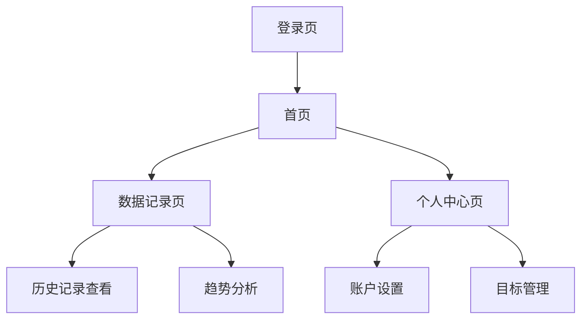
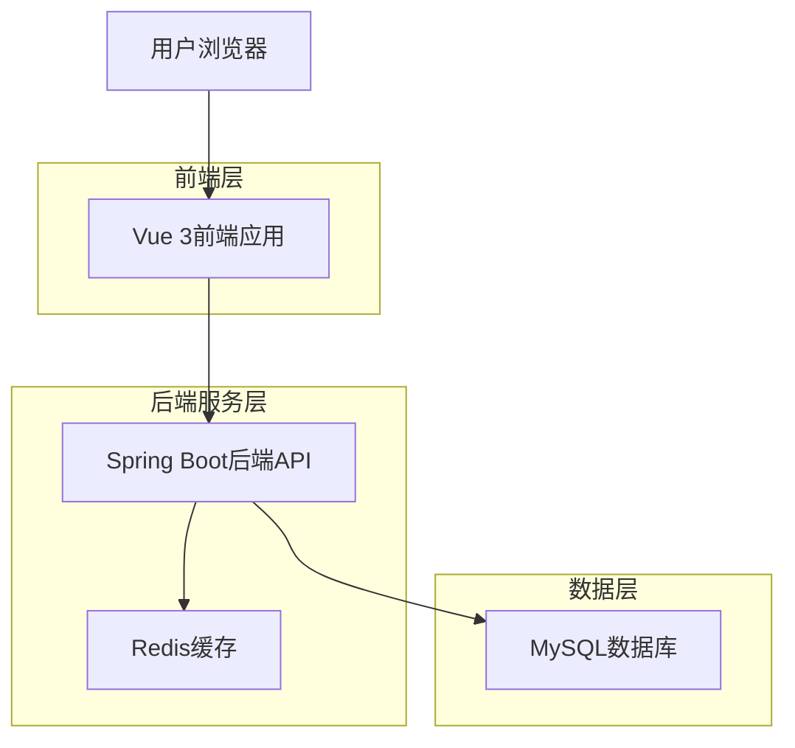
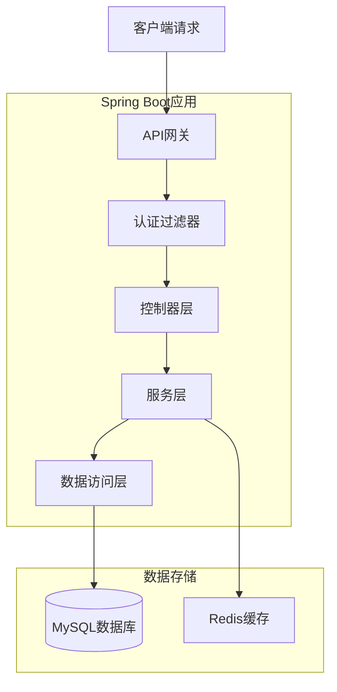

# 健康管理系统项目阅读说明文档

## 1. 产品概述

### 1.1 项目背景

随着人们健康意识的提高，健康管理成为日常生活中的重要组成部分。本项目旨在为用户提供一个便捷、安全的健康管理平台，帮助用户记录和管理个人健康数据，提高健康管理效率。

### 1.2 目标用户

- 普通用户：需要管理个人健康数据的个人
- 健康管理者：需要监控和分析健康数据的专业人士

### 1.3 核心价值

- 提供安全可靠的用户认证系统
- 支持用户健康数据的记录和管理
- 提供直观的数据可视化界面
- 确保用户数据的安全性和隐私性

## 2. 核心功能模块说明

### 2.1 用户认证模块

- **用户注册**：支持通过用户名、邮箱和手机号进行注册，包含密码强度检测和重复提交防护
- **用户登录**：支持通过用户名、邮箱或手机号登录，包含登录失败次数限制和账号锁定机制
- **JWT token生成**：登录成功后生成JWT token用于后续身份验证

### 2.2 健康数据管理模块

- **数据输入**：支持用户输入健康相关数据
- **数据可视化**：通过图表展示健康数据趋势
- **数据存储**：安全存储用户健康数据

### 2.3 AI健康助手模块

- **智能对话**：支持用户与AI进行自然语言交互
- **健康咨询**：提供头痛、失眠、感冒、运动、饮食、压力等健康问题咨询
- **个性化建议**：基于用户输入提供健康建议
- **免责声明**：所有AI回复都包含必要的免责声明

### 2.4 系统安全模块

- **密码加密**：使用Spring Security的密码加密机制
- **登录日志**：记录用户登录行为，包括成功和失败的登录尝试
- **Rate Limiting**：防止暴力破解和DoS攻击

## 3. 业务流程介绍


### 3.1 用户注册流程

1. 用户访问注册页面，填写注册信息（用户名、邮箱、密码、手机号）
2. 前端进行表单验证，包括密码强度检测
3. 后端接收注册请求，进行防重复提交检查
4. 后端检查用户名、邮箱、手机号是否已存在
5. 后端创建用户记录，加密密码
6. 后端生成JWT token
7. 前端保存token并自动登录跳转到首页

### 3.2 用户登录流程

1. 用户访问登录页面，输入账号（用户名/邮箱/手机号）和密码
2. 前端进行表单验证
3. 后端接收登录请求，检查账号是否被锁定
4. 后端根据账号类型（用户名/邮箱/手机号）查找用户
5. 后端验证密码，记录登录日志
6. 登录失败：记录失败原因，增加失败次数，达到阈值后锁定账号
7. 登录成功：清除失败记录，更新最后登录时间，生成JWT token
8. 前端保存token并跳转到首页

## 4. 界面设计规范

### 4.1 UI风格

- **设计风格**：玻璃态（Glassmorphism）设计，具有现代感和科技感
- **配色方案**：深色背景配合紫色和蓝色的渐变，营造专业、宁静的氛围
- **字体**：现代无衬线字体，清晰易读
- **动效**：平滑的过渡动画和微交互，提升用户体验

### 4.2 组件设计

- **GlassCard**：半透明卡片组件，带有模糊效果和边框
- **GlassInput**：半透明输入框，带有聚焦动画效果
- **GlassButton**：渐变按钮，带有悬停和点击效果
- **AnimatedBg**：动态背景效果，增强视觉体验

### 4.3 响应式布局

- **桌面端**：完整功能展示，多列布局
- **平板端**：适当调整布局，保持核心功能
- **移动端**：单列布局，优化触摸交互

## 5. 系统架构设计

### 5.1 前后端分离架构

- **前端**：Vue 3 + TypeScript + Element Plus + Tailwind CSS
- **后端**：Spring Boot + JPA + H2 + JWT + Redis
- **通信**：RESTful API

### 5.2 技术选型说明

- **前端**：选择Vue 3作为前端框架，TypeScript提供类型安全，Element Plus提供丰富的UI组件，Tailwind CSS提供灵活的样式管理
- **后端**：选择Spring Boot作为后端框架，JPA简化数据库操作，H2作为嵌入式数据库，JWT实现无状态认证，Redis用于缓存和速率限制

## 6. 技术架构设计


### 6.1 后端技术栈

- **Spring Boot 3**：应用框架，提供自动配置和依赖管理
- **Spring Security**：安全框架，提供认证和授权功能
- **Spring Data JPA**：ORM框架，简化数据库操作
- **H2 Database**：嵌入式数据库，适合开发和测试
- **JWT**：无状态认证机制
- **Redis**：缓存和速率限制
- **Swagger/OpenAPI**：API文档生成

### 6.2 前端技术栈

- **Vue 3**：前端框架，提供组合式API
- **TypeScript**：类型安全的JavaScript超集
- **Element Plus**：UI组件库
- **Tailwind CSS**：实用优先的CSS框架
- **Pinia**：状态管理库
- **Vue Router**：路由管理
- **Axios**：HTTP客户端
- **ECharts**：数据可视化库
- **GSAP**：动画库

## 7. 路由设计

### 7.1 前端路由

- `/`：首页，用户健康数据展示
- `/login`：登录页面
- `/register`：注册页面
- `/ai-chat`：AI健康助手对话页面

### 7.2 后端路由

- `/api/auth/register`：用户注册接口
- `/api/auth/login`：用户登录接口

### 7.3 权限控制机制

- **前端**：通过localStorage存储JWT token，在请求头中携带token
- **后端**：使用JWT进行身份验证，Spring Security进行权限控制

## 8. API接口定义

### 8.1 用户注册接口

- **请求方法**：POST
- **URL**：/api/auth/register
- **请求参数**：
  - username：用户名（必填，最大长度50）
  - email：邮箱（必填，最大长度100）
  - password：密码（必填，最大长度72）
  - phone：手机号（可选，11位数字）
- **返回格式**：
  ```json
  {
    "code": 200,
    "message": "success",
    "data": {
      "token": "JWT token",
      "userId": 1,
      "username": "user1"
    }
  }
  ```
- **错误码**：
  - 400：请求参数错误
  - 409：用户名/邮箱/手机号已存在

### 8.2 用户登录接口

- **请求方法**：POST
- **URL**：/api/auth/login
- **请求参数**：
  - account：账号（用户名/邮箱/手机号，必填）
  - password：密码（必填）
- **返回格式**：
  ```json
  {
    "code": 200,
    "message": "success",
    "data": {
      "token": "JWT token",
      "userId": 1,
      "username": "user1"
    }
  }
  ```
- **错误码**：
  - 400：请求参数错误
  - 401：账号或密码错误
  - 423：账号被锁定

### 8.3 AI对话接口

- **请求方法**：POST
- **URL**：/api/ai/chat
- **请求头**：
  - Authorization: Bearer {token} （需要JWT身份验证）
- **请求参数**：
  ```json
  {
    "message": "用户输入的健康问题",
    "history": [
      {
        "role": "user",
        "content": "历史用户消息"
      },
      {
        "role": "assistant",
        "content": "历史AI回复"
      }
    ]
  }
  ```
  - message：用户输入的消息内容（必填，最大长度2000字符）
  - history：对话历史记录（可选），用于多轮对话上下文管理
- **返回格式**：
  ```json
  {
    "code": 200,
    "message": "success",
    "data": {
      "answer": "AI的健康建议回复",
      "hasDisclaimer": true,
      "disclaimer": "免责声明：本AI提供的健康建议仅供参考，不能替代专业医生的诊断和治疗。如有不适，请及时就医。"
    }
  }
  ```
- **错误码**：
  - 400：请求参数错误
  - 401：未登录或登录已过期
  - 500：服务器内部错误

## 9. 服务器架构图



## 10. 数据模型设计

### 10.1 用户表（users）

| 字段名            | 数据类型         | 约束                                   | 描述               |
| -------------- | ------------ | ------------------------------------ | ---------------- |
| id             | BIGINT       | PRIMARY KEY, AUTO\_INCREMENT         | 用户ID             |
| username       | VARCHAR(50)  | UNIQUE, NOT NULL                     | 用户名              |
| password       | VARCHAR(255) | NOT NULL                             | 密码（加密）           |
| email          | VARCHAR(100) | UNIQUE, NOT NULL                     | 邮箱               |
| phone          | VARCHAR(20)  | UNIQUE                               | 手机号              |
| avatarUrl      | VARCHAR(255) | <br />                               | 头像URL            |
| membershipType | VARCHAR(20)  | DEFAULT 'free'                       | 会员类型             |
| status         | INT          | NOT NULL, DEFAULT 1                  | 状态（1: 活跃, 0: 锁定） |
| lastLoginTime  | TIMESTAMP    | <br />                               | 最后登录时间           |
| createdAt      | TIMESTAMP    | NOT NULL, DEFAULT CURRENT\_TIMESTAMP | 创建时间             |
| updatedAt      | TIMESTAMP    | NOT NULL, DEFAULT CURRENT\_TIMESTAMP | 更新时间             |

### 10.2 登录日志表（login\_logs）

| 字段名        | 数据类型         | 约束                                   | 描述                           |
| ---------- | ------------ | ------------------------------------ | ---------------------------- |
| id         | BIGINT       | PRIMARY KEY, AUTO\_INCREMENT         | 日志ID                         |
| userId     | BIGINT       | NOT NULL                             | 用户ID                         |
| loginIp    | VARCHAR(50)  | <br />                               | 登录IP                         |
| loginType  | VARCHAR(20)  | <br />                               | 登录类型（USERNAME, EMAIL, PHONE） |
| success    | BOOLEAN      | <br />                               | 是否成功                         |
| failReason | VARCHAR(255) | <br />                               | 失败原因                         |
| userAgent  | VARCHAR(255) | <br />                               | 用户代理                         |
| loginTime  | TIMESTAMP    | NOT NULL, DEFAULT CURRENT\_TIMESTAMP | 登录时间                         |

## 11. Docker部署配置说明

### 11.1 后端Dockerfile

```dockerfile
# Build stage
FROM maven:3.9-eclipse-temurin-17-alpine AS build
WORKDIR /app
COPY pom.xml .
COPY src ./src
RUN mvn clean package -DskipTests

# Production stage
FROM eclipse-temurin:17-jre-alpine
WORKDIR /app
COPY --from=build /app/target/*.jar app.jar
EXPOSE 8080
ENTRYPOINT ["java", "-jar", "app.jar"]
```

### 11.2 前端Dockerfile

```dockerfile
# Build stage
FROM node:20-alpine as build-stage
WORKDIR /app
COPY package*.json ./
RUN npm install
COPY . .
RUN npm run build

# Production stage
FROM nginx:stable-alpine as production-stage
COPY --from=build-stage /app/dist /usr/share/nginx/html
EXPOSE 80
CMD ["nginx", "-g", "daemon off;"]
```

### 11.3 环境变量配置

- **后端**：
  - REDIS\_HOST：Redis主机地址（默认：localhost）
  - REDIS\_PORT：Redis端口（默认：6379）
  - JWT\_SECRET：JWT密钥
  - JWT\_EXPIRATION：JWT过期时间（默认：86400000毫秒）

### 11.4 容器编排

使用Docker Compose可以方便地编排前后端容器和Redis服务：

```yaml
version: '3.8'
services:
  backend:
    build: ./health-management-system
    ports:
      - "8080:8080"
    environment:
      - REDIS_HOST=redis
      - REDIS_PORT=6379
    depends_on:
      - redis
  frontend:
    build: ./health-management-web
    ports:
      - "80:80"
  redis:
    image: redis:7-alpine
    ports:
      - "6379:6379"
```

## 12. 项目启动与开发

### 12.1 后端开发环境

1. 克隆项目：`git clone <repository-url>`
2. 进入后端目录：`cd health-management-system`
3. 构建项目：`mvn clean package`
4. 运行项目：`mvn spring-boot:run`
5. 访问API文档：`http://localhost:8080/api/swagger-ui.html`

### 12.2 前端开发环境

1. 进入前端目录：`cd health-management-web`
2. 安装依赖：`npm install`
3. 启动开发服务器：`npm run dev`
4. 访问前端应用：`http://localhost:5173`

## 13. 项目维护与扩展

### 13.1 代码规范

- 后端：遵循Spring Boot代码规范，使用JavaDoc注释
- 前端：遵循Vue 3和TypeScript代码规范，使用ESLint进行代码检查

### 13.2 测试策略

- 单元测试：使用JUnit和Mockito进行后端单元测试
- 集成测试：测试API接口和前后端交互
- 端到端测试：使用Playwright进行完整流程测试

### 13.3 扩展建议

- 添加健康数据管理功能，如体重、血压、血糖等数据的记录和分析
- 实现数据导出和分享功能
- 添加社交功能，如健康挑战和社区互动
- 集成第三方健康设备和应用
- 实现多语言支持

## 14. 总结

健康管理系统是一个现代化的前后端分离应用，采用了先进的技术栈和设计理念。系统提供了安全可靠的用户认证功能，为后续的健康数据管理功能奠定了基础。通过本项目阅读说明文档，新开发人员可以快速了解项目的整体架构、核心功能和技术实现，从而更好地参与项目开发和维护。
